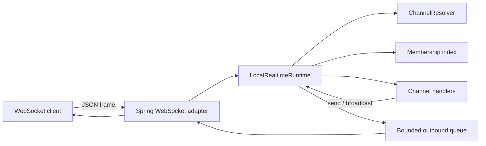

# Kanal

한국어 | [English](README.md)

Kanal은 JVM 애플리케이션을 위한 Kotlin-first 실시간 채널 프레임워크입니다.

WebSocket 기능을 만들 때 필요한 channel, session, presence, membership, backpressure, metrics를 애플리케이션 코드의 개념으로 다룰 수 있게 합니다. 목표는 실시간 기능을 socket handler 묶음이 아니라 평범한 서버 코드처럼 작성하게 만드는 것입니다.

> 상태: 초기 개발 중입니다. Core DSL, local runtime foundation, Spring Boot WebSocket adapter, sample app을 함께 만들고 있습니다.

## 왜 필요한가

대부분의 JVM 팀은 WebSocket 연결을 열 수 있습니다. 어려운 부분은 그 주변에 있습니다.

- room에 join하고 leave하기
- 어떤 session이 어떤 channel에 들어와 있는지 추적하기
- presence 상태 관리하기
- 여러 client로 broadcast하기
- 느린 client 처리하기
- queue depth, drop, handler latency 측정하기
- live socket을 옮기지 않고 cluster routing 준비하기

Kanal은 이 반복되는 작업을 하나의 작은 application model로 묶습니다.

## 빠른 예시

```kotlin
import io.github.kimseungjin.kanal.core.dsl.channel
import io.github.kimseungjin.kanal.core.dsl.realtime

data class ChatMessage(val body: String)

val app =
    realtime {
        channel<ChatMessage>("chat/{roomId}") {
            onJoin {
                presence.track(
                    key = session.userId ?: session.id,
                    metadata = mapOf("roomId" to address.parameters.getValue("roomId")),
                )
            }

            onMessage { message ->
                broadcast(message)
            }
        }
    }
```

Client는 단순한 JSON frame을 보냅니다.

```json
{
  "ref": "1",
  "event": "message",
  "channel": "chat/general",
  "payload": {
    "body": "hello"
  }
}
```

초기 event:

- `join`
- `leave`
- `message`
- `heartbeat`
- `reply`
- `error`

Reply payload는 안정적인 envelope 형태를 사용합니다.

```json
{
  "event": "reply",
  "payload": {
    "event": "join",
    "status": "ok",
    "response": {}
  }
}
```

Error payload는 machine-readable code를 포함합니다.

```json
{
  "event": "error",
  "payload": {
    "code": "payload_decode_failed",
    "message": "Payload could not be decoded for 'chat/general'"
  }
}
```

## 모듈

- `kanal-core`: channel DSL, channel matching, session, context, presence, backpressure type
- `kanal-runtime`: local runtime, membership index, bounded outbound queue, handler dispatch, runtime metrics
- `kanal-benchmarks`: resolution, broadcast, queue hot path를 검증하는 lightweight executable benchmark fixture
- `kanal-spring-boot-starter`: Spring Boot autoconfiguration과 WebSocket integration
- `kanal-cluster-redis`: Redis cluster metadata model, keyspace, TTL option, adapter contract skeleton
- `kanal-samples:chat-presence`: chat과 presence sample app

계획 중:

- Redis-backed metadata store implementation
- cross-node broadcast routing

## Spring Boot

Starter는 WebSocket endpoint를 열고 `RealtimeApplication`을 local runtime에 연결합니다.

```properties
kanal.endpoint=/realtime
kanal.heartbeat-interval=30s
kanal.heartbeat-timeout=90s
kanal.metrics-enabled=true
kanal.actuator-enabled=true
kanal.outbound-queue-capacity=256
kanal.max-text-message-buffer-size=65536
kanal.max-binary-message-buffer-size=65536
kanal.max-session-idle-timeout=5m
kanal.async-send-timeout=10s
kanal.handler-execution=direct
kanal.virtual-thread-name-prefix=kanal-handler
```

`kanal.handler-execution=virtual-threads`로 설정하면 channel handler가 virtual-thread-per-task executor에서 실행됩니다. Handler API는 단순하게 유지하고, socket I/O는 transport layer에 남기는 방향입니다.

`kanal.metrics-enabled=true`일 때 starter는 runtime session, membership, frame, drop, slow-consumer signal, disconnect reason, heartbeat timeout, handler failure, payload decode failure, queue depth, fan-out, handler latency를 Micrometer `MeterBinder`로 노출합니다.

`kanal.actuator-enabled=true`일 때 starter는 runtime counter와 active session, joined channel, queue depth, last-seen diagnostics를 반환하는 `kanal` Actuator endpoint를 등록합니다.

## Runtime 구조



중요한 선택:

- channel pattern은 registration 시점에 compile하고 validate합니다.
- hot path에서 큰 session set을 복사하지 않도록 membership lookup을 분리했습니다.
- outbound queue는 기본적으로 bounded입니다.
- 느린 client는 명시적인 backpressure policy로 처리합니다.
- heartbeat frame 전송과 heartbeat timeout cleanup은 local runtime lifecycle에 포함됩니다.
- handler failure, payload decode failure, malformed WebSocket frame은 runtime을 죽이지 않고 진단 정보로 남깁니다.
- socket은 연결을 수락한 node에 남깁니다. 이후 cluster support는 metadata 기반 routing으로 갑니다.
- metrics는 나중에 붙이는 기능이 아니라 runtime model의 일부입니다.

## Benchmarks

Local benchmark fixture는 다음 명령으로 실행합니다.

```bash
./gradlew :kanal-benchmarks:run --args="--iterations 100000 --channels 1000 --sessions 1000"
```

현재 channel resolution, local broadcast fan-out, bounded queue offer behavior를 다룹니다. 이 숫자는 아직 release claim이 아니라 regression check를 위한 반복 가능한 시작점입니다.

## 현재 진행 상황

구현된 foundation:

- typed channel DSL
- compiled channel pattern matching
- in-memory presence store
- local membership index
- bounded outbound queue
- local runtime counter
- lightweight benchmark fixture
- `join`, `leave`, `message`, `heartbeat` JSON frame dispatch
- stable reply와 error payload envelope
- scheduled heartbeat frame과 heartbeat timeout cleanup
- session disconnect와 membership 정리를 수행하는 graceful runtime close
- slow-consumer diagnostics와 disconnect reason tracking
- handler failure와 payload decode failure counter
- malformed WebSocket frame error response
- Spring Boot WebSocket adapter
- Jackson 3 payload codec
- virtual-thread handler execution option
- Micrometer runtime meter binder
- session과 queue detail을 포함한 Actuator runtime diagnostics endpoint
- browser client와 WebSocket end-to-end test가 있는 runnable chat and presence sample
- Redis cluster metadata/keyspace/options skeleton

아직 초기 단계:

- Redis cluster adapter implementation
- release packaging

## 테스트

2026-05-26 기준:

| 범위 | 명령 | 결과 |
| --- | --- | --- |
| Runtime | `./gradlew :kanal-runtime:test` | 통과 |
| Spring starter | `./gradlew :kanal-spring-boot-starter:test` | 통과 |
| 전체 테스트 | `./gradlew test` | 통과 |

Channel resolution, join/message/leave dispatch, heartbeat lifecycle, runtime close cleanup, broadcast fan-out, bounded queue policy, slow-consumer diagnostics, disconnect reason, handler failure, payload decode failure, malformed WebSocket frame, runtime metrics, Micrometer meter binding, Spring autoconfiguration, WebSocket bean, Jackson payload codec, virtual-thread handler execution을 확인했습니다.

## 문서

- [Architecture](docs/architecture.ko.md)
- [Roadmap](docs/roadmap.ko.md)
- [Chat presence example](docs/examples/chat-presence.ko.md)
- [English README](README.md)

## 지금은 하지 않는 것

- durable delivery guarantee
- global strong consistency
- automatic connection migration
- custom message broker
- full actor runtime
