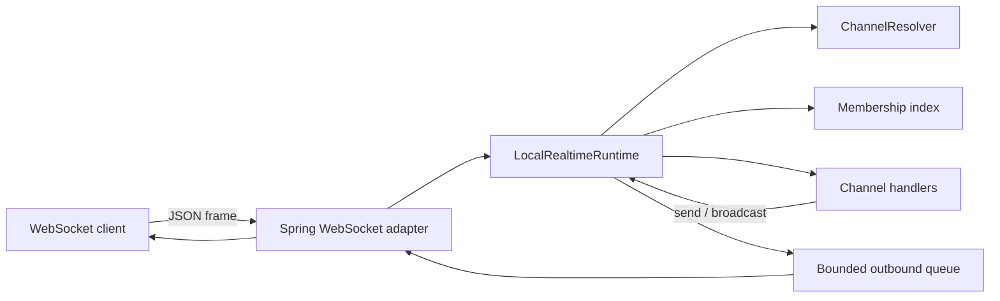

# Kanal

[한국어](README.ko.md) | English

Kanal is a Kotlin-first realtime channel framework for JVM applications.

It helps you build WebSocket features with application-level concepts: channels, sessions, presence, membership, backpressure, and metrics. The goal is to make realtime code feel like normal server code, not a pile of socket handlers.

> Status: early development. The core DSL, local runtime foundation, Spring Boot WebSocket adapter, and sample app are being built together.

## Why

Most JVM teams can open a WebSocket connection. The hard part is everything around it:

- joining and leaving rooms
- tracking which sessions belong to which channel
- keeping presence state
- broadcasting to many clients
- handling slow consumers
- measuring queue depth, drops, and handler latency
- preparing for cluster routing without moving live sockets

Kanal puts those pieces behind one small application model.

## Quick Look

```kotlin
import io.github.kimseungjin.kanal.core.dsl.channel
import io.github.kimseungjin.kanal.core.dsl.realtime

data class ChatMessage(val body: String)

val app =
    realtime {
        channel<ChatMessage>("chat/{roomId}") {
            onJoin {
                presence.track(
                    key = session.userId ?: session.id,
                    metadata = mapOf("roomId" to address.parameters.getValue("roomId")),
                )
            }

            onMessage { message ->
                broadcast(message)
            }
        }
    }
```

Clients send simple JSON frames:

```json
{
  "ref": "1",
  "event": "message",
  "channel": "chat/general",
  "payload": {
    "body": "hello"
  }
}
```

Supported early events:

- `join`
- `leave`
- `message`
- `heartbeat`
- `reply`
- `error`

Reply payloads use a stable envelope:

```json
{
  "event": "reply",
  "payload": {
    "event": "join",
    "status": "ok",
    "response": {}
  }
}
```

Error payloads include a machine-readable code:

```json
{
  "event": "error",
  "payload": {
    "code": "payload_decode_failed",
    "message": "Payload could not be decoded for 'chat/general'"
  }
}
```

## Modules

- `kanal-core`: channel DSL, channel matching, session, context, presence, and backpressure types
- `kanal-runtime`: local runtime, membership index, bounded outbound queues, handler dispatch, and runtime metrics
- `kanal-benchmarks`: lightweight executable benchmark fixture for resolution, broadcast, and queue hot paths
- `kanal-spring-boot-starter`: Spring Boot autoconfiguration and WebSocket integration
- `kanal-cluster-redis`: Redis cluster metadata model, keyspace, TTL options, and adapter contract skeleton
- `kanal-samples:chat-presence`: chat and presence sample app

Planned:

- Redis-backed metadata store implementation
- cross-node broadcast routing

## Spring Boot

The starter exposes a WebSocket endpoint and wires a `RealtimeApplication` into the local runtime.

```properties
kanal.endpoint=/realtime
kanal.heartbeat-interval=30s
kanal.heartbeat-timeout=90s
kanal.metrics-enabled=true
kanal.actuator-enabled=true
kanal.outbound-queue-capacity=256
kanal.max-text-message-buffer-size=65536
kanal.max-binary-message-buffer-size=65536
kanal.max-session-idle-timeout=5m
kanal.async-send-timeout=10s
kanal.handler-execution=direct
kanal.virtual-thread-name-prefix=kanal-handler
```

Set `kanal.handler-execution=virtual-threads` to run channel handlers on a virtual-thread-per-task executor. This keeps the handler API simple while leaving socket I/O in the transport layer.

When `kanal.metrics-enabled=true`, the starter registers a Micrometer `MeterBinder` for runtime sessions, memberships, frames, drops, slow-consumer signals, disconnect reasons, heartbeat timeouts, handler failures, payload decode failures, queue depth, fan-out, and handler latency.

When `kanal.actuator-enabled=true`, the starter registers a `kanal` Actuator endpoint with runtime counters plus active session, joined channel, queue depth, and last-seen diagnostics.

## Runtime Model



Important choices:

- channel patterns are compiled and validated at registration time
- membership lookup avoids copying large session sets on the hot path
- outbound queues are bounded by default
- slow consumers are handled through explicit backpressure policies
- heartbeat frames and heartbeat timeout cleanup are part of the local runtime lifecycle
- handler failures, payload decode failures, and malformed WebSocket frames are reported without taking down the runtime
- sockets stay on the node that accepted them; future cluster support should route messages by metadata
- metrics are part of the runtime model, not an afterthought

## Benchmarks

Run the local benchmark fixture with:

```bash
./gradlew :kanal-benchmarks:run --args="--iterations 100000 --channels 1000 --sessions 1000"
```

It currently covers channel resolution, local broadcast fan-out, and bounded queue offer behavior. These numbers are not release claims yet; they are a repeatable starting point for regression checks.

## Current Progress

Implemented foundation:

- typed channel DSL
- compiled channel pattern matching
- in-memory presence store
- local membership index
- bounded outbound queue
- local runtime counters
- lightweight benchmark fixture
- JSON frame dispatch for `join`, `leave`, `message`, and `heartbeat`
- stable reply and error payload envelopes
- scheduled heartbeat frames and heartbeat timeout cleanup
- graceful runtime close that disconnects sessions and clears memberships
- slow-consumer diagnostics and disconnect reason tracking
- handler failure and payload decode failure counters
- malformed WebSocket frame error responses
- Spring Boot WebSocket adapter
- Jackson 3 payload codec
- virtual-thread handler execution option
- Micrometer runtime meter binder
- Actuator runtime diagnostics endpoint with session and queue details
- runnable chat and presence sample with a browser client and WebSocket end-to-end test
- Redis cluster metadata/keyspace/options skeleton

Still early:

- Redis cluster adapter implementation
- release packaging

## Tests

As of 2026-05-26:

| Scope | Command | Result |
| --- | --- | --- |
| Runtime | `./gradlew :kanal-runtime:test` | Pass |
| Spring starter | `./gradlew :kanal-spring-boot-starter:test` | Pass |
| Full suite | `./gradlew test` | Pass |

Covered areas include channel resolution, join/message/leave dispatch, heartbeat lifecycle, runtime close cleanup, broadcast fan-out, bounded queue policy, slow-consumer diagnostics, disconnect reasons, handler failures, payload decode failures, malformed WebSocket frames, runtime metrics, Micrometer meter binding, Spring autoconfiguration, WebSocket beans, Jackson payload codec, and virtual-thread handler execution.

## Docs

- [Architecture](docs/architecture.md)
- [Roadmap](docs/roadmap.md)
- [Chat presence example](docs/examples/chat-presence.md)
- [한국어 README](README.ko.md)

## Non-Goals For Now

- durable delivery guarantees
- global strong consistency
- automatic connection migration
- custom message broker
- full actor runtime
